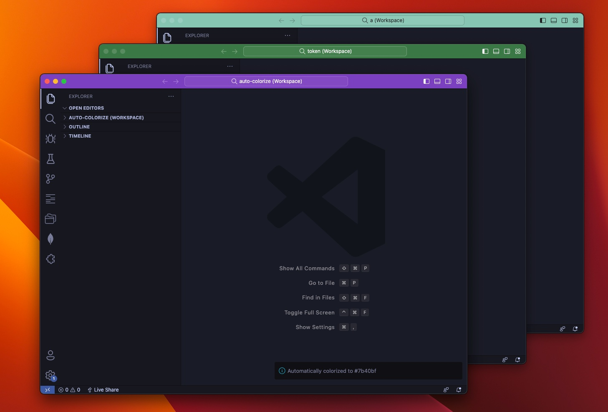

# vscode-auto-colorize

Automatically color your workspace.

  
  
<i>Example</i>

## Install

https://marketplace.visualstudio.com/items?itemName=bisquit.vscode-auto-colorize

This extension automatically colors the workspace when opening `.vscode-workspace`, if it doesn't have color configurations.

If you want to find what was configured, type `Cmd + Shift + P` > `Workspaces: Open Workspace Configuration File` and see `workbench.colorCustomizations` section.

## Commands

| commands                 | description                          | Shortcut |
| ------------------------ | ------------------------------------ | -------- |
| `Auto Colorize: Recolor` | Force colorize your workspace again. |          |

## Related

- [Peacock](https://github.com/johnpapa/vscode-peacock)
